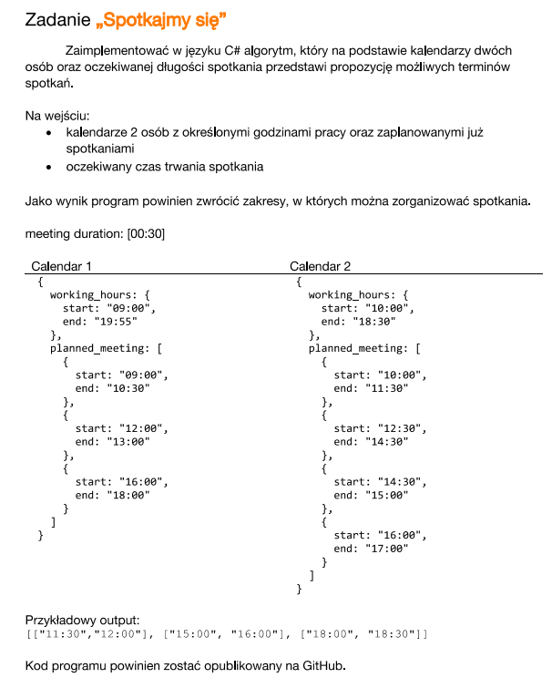

# Orange Let's Meet

* This is a kind of overkill for the given task but is designed to show C# competency :yum:

## Features
 * Support `any number` of timetables to work with
 * Allow unsorted data
 * Json input

## Task



## Usage

Pass `json` file which contains data like following:

<details><summary>CLICK TO SHOW EXAMPLE JSON</summary>

```json
{
  "duration": "00:10",
  "participantTimetables": [
    {
      "workingHours": {
        "start": "09:00",
        "end": "19:55"
      },
      "meetings": [
        {
          "start": "15:30",
          "end": "15:40"
        },
        {
          "start": "16:00",
          "end": "16:20"
        }
      ]
    },
    {
      "workingHours": {
        "start": "09:00",
        "end": "19:55"
      },
      "meetings": [
        {
          "start": "09:00",
          "end": "9:50"
        },
        {
          "start": "12:00",
          "end": "13:00"
        },
        {
          "start": "16:30",
          "end": "18:00"
        }
      ]
    },
    {
      "workingHours": {
        "start": "9:50",
        "end": "18:30"
      },
      "meetings": [
        {
          "start": "10:00",
          "end": "11:30"
        },
        {
          "start": "12:30",
          "end": "14:30"
        },
        {
          "start": "14:30",
          "end": "15:00"
        },
        {
          "start": "16:45",
          "end": "17:00"
        }
      ]
    }
  ]
}
```

</details>

## Output

```text
Meeting with duration: 00:10 can be planned at:

[["09:50","10:00"]["11:30","12:00"]["15:00","15:30"]["15:40","16:00"]["16:20","16:30"]["18:00","18:30"]]
```

### Give it a try! :smile: